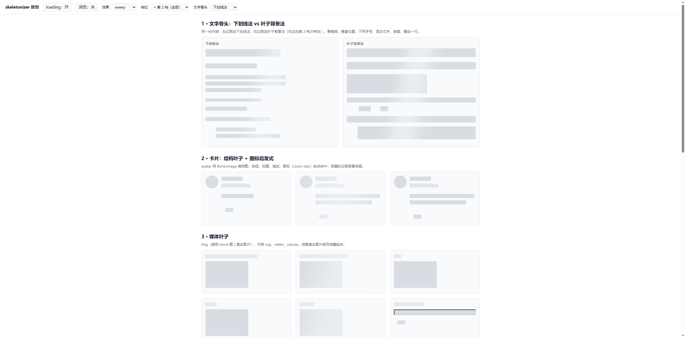
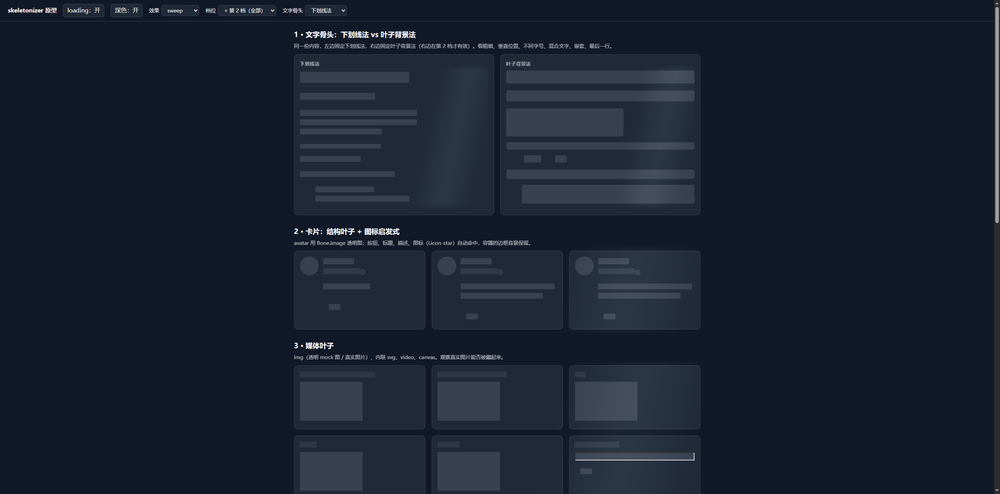

## TL;DR

- （数字在 CPU 被占满的环境下测得，绝对值待空闲重测，见下方警告。）
- 静态规则不贵：约 4000 个元素时，四档 CSS 加起来一次性约 70ms。
- **贵的是动画**：旧默认（每个元素各挂一个动画）4000 元素每帧 231ms，约 4 帧/秒。
- 优化后默认改成**根级 opacity 的 fade**：同样 4000 / 16000 个元素，每帧稳定 16.5ms，跟 `solid` 一样。
- `pulse` / `shimmer` 仍是元素级动画，**没变快**，只是被 `enable()` 的阈值保护（默认 300 个元素以上自动降 fade）。

环境：Windows 桌面 Chrome（DevTools 协议驱动），本机单次测量，**没有跨机器、跨浏览器**。

> ⚠️ **测量环境不干净**：事后查到本机 CPU 持续 100%（20 个逻辑核被占满，有 Rust 编译在跑），这些数字很可能是在 CPU 争抢下测的。**绝对数值不可信，尤其是主线程耗时（pulse / shimmer 每帧、开启耗时）；`fade` 和 `solid` 贴着 16.6ms 是被 vsync 封顶的，受影响小。** 各配置之间的相对排序大概率还成立，但倍数要等机器空闲时重测。第 4 节那个开启耗时异常，也不能排除是调度噪声。基准页 `demo/bench.html`，每张卡片约 8 个元素（img、h3、p、span、i、button 等）；控制台里可以直接 `await bench(500, [['sk-effect','pulse']])` 复现每帧耗时。

## 1. 优化前

### 1.1 开启骨架的一次性耗时（500 张卡片 ≈ 4000 元素，强制样式 + 布局）

| 加载的样式                          | 耗时      |
| ----------------------------------- | --------- |
| 无                                  | 0.1ms     |
| 兜底层                              | 29ms      |
| + 第 0 档                           | 58ms      |
| + 第 1 档                           | 66ms      |
| + 第 2 档（含 `:has`）              | 69ms      |
| + effects.css（旧版，含元素级动画） | **459ms** |

静态规则合计约 17µs/元素；`:has` 那条规则几乎没成本（但测试页里没有 `sk-ignore`，有的话没测）。动画一进来一次性耗时涨 6 倍，因为要给每个元素创建动画对象。

### 1.2 动画每帧耗时（目标 16.6ms）

| 配置                                         | 4000 元素 | 16000 元素 |
| -------------------------------------------- | --------- | ---------- |
| 旧默认（下划线文字 pulse，每个元素一个动画） | 231~241ms | 963ms      |
| pulse                                        | 268ms     | 942ms      |
| 叶子模式 shimmer                             | 99~115ms  | 458ms      |
| solid（无动画）                              | 16.6ms    | 16.5ms     |

结论：成本约 58µs/元素/帧，线性增长，主线程被占满。

### 1.3 当时试过的几个替代方案（4000 元素每帧）

| 方案                                                     | 耗时       | 评价                                                   |
| -------------------------------------------------------- | ---------- | ------------------------------------------------------ |
| A. 根上一个注册的 `@property` 颜色变量做动画，元素引用它 | 64ms       | 好 3.6 倍，但仍要每帧重算所有元素                      |
| C. 叶子 shimmer 同理，根上一个 `--sk-x`                  | 84ms       | 意义不大                                               |
| D. 去掉 `background-attachment: fixed`                   | 99ms       | **没变化**，说明瓶颈不在 fixed，而在每个元素各一个动画 |
| **B. 根整体 opacity 脉冲**                               | **16.6ms** | 和 solid 一样，动画跑在合成器线程                      |

## 2. 已落地的三条优化

1. **默认效果改成根级 `opacity` 脉冲（`fade`）**。没写 `sk-effect` 时生效；根里含 `sk-ignore` 时，隐式默认不开 fade（`:has([sk-ignore])` 判断，否则会把 ignore 的内容一起淡掉），要强制开就显式写 `sk-effect="fade"`。`prefers-reduced-motion` 下关闭。
2. **去掉 `*` 上的 `animation`**。第 1 档不再给所有元素挂动画，元素级动画只在显式选 `pulse` / `shimmer` 时才通过 `effects.css` 里的限定选择器生效。
3. **`enable()` 加阈值保护**。选了 `pulse` / `shimmer` 且根下元素数超过 `maxAnimated`（默认 `MAX_ANIMATED = 300`）时，自动改写成 `fade`；传大数可以强制保留。只管通过 `enable()` / `<sk-skeleton>` 进来的；纯 HTML 里直接写 `sk-effect="shimmer"` 不受保护。

## 3. 优化后复测

| 配置                           | 4000 元素每帧 | 16000 元素每帧 |
| ------------------------------ | ------------- | -------------- |
| 页面无骨架（对照，有测量噪声） | 18.3ms        | 22.1ms         |
| **默认（fade）**               | **16.5ms**    | **16.8ms**     |
| solid                          | 16.7ms        | 16.7ms         |
| pulse（元素级，下划线文字）    | 255ms         | 896ms          |
| shimmer（元素级，叶子模式）    | 99.6ms        | 452ms          |

`enable(root, { effect: 'shimmer' })` 在 4000 / 16000 个元素的根上都被改写成 `fade`；传 `maxAnimated: 1e9` 则保留 `shimmer`，都已验证。

默认路径的一次性开启耗时：4000 元素约 83ms（优化前 369ms）。

## 4. 没量清楚的地方（别当结论用）

- **开启耗时的一个异常**：16000 元素下，默认（fade）强制布局只要 0.5~1.4ms，等同配置换成 `sk-effect="solid"` 却要 175ms；改成"等到下一帧"的口径后，默认约 6~18ms、solid 约 250~290ms，差距仍在。**我没找到原因**，不能据此说默认路径更快，只能说"每帧耗时"这个指标是可信的。需要 Performance trace 才能定位。
- **滚动性能没测**：`background-attachment: fixed` 是否拖慢滚动，没验证（D 方案只证明它不是动画开销的瓶颈）。
- `pulse` / `shimmer` 在元素级仍然很贵，目前只靠阈值兜底；下面几条没做：根上叠 `::after` 渐变条用 `transform` 做 shimmer（会提亮整个根，未验证）、屏幕外根用 `IntersectionObserver` 暂停动画。
- 只测了桌面 Chrome；手机和低端机会更差，估计倍数不可靠。

## 5. sweep 原型：整个根一个 `::after` 扫光（只看了视觉，性能未测）

`sk-effect="sweep"`：根上一个 `::after` 渐变条，`transform` 平移（合成器线程），`mix-blend-mode: soft-light` 让它主要提亮中灰的骨头。根会被加上 `position: relative` 和裁剪（`overflow: clip`）。

视觉观察（桌面 Chrome，动画冻结在中段后截图）：

| 浅色                           | 深色                          |
| ------------------------------ | ----------------------------- |
|  |  |

- ✅ **浅色下基本符合预期**：灰骨头被提亮，近白的卡片背景几乎看不出变化。
- ⚠️ **深色下会漏到容器背景**：卡片背景是中间调，也被提亮成一道浅色竖条。把深色高光从 .6 降到 .22 后明显淡了，但没消失。这是混合模式的固有局限，不是调参能彻底解决的。
- ⚠️ **每个根各扫各的**：一个根一个伪元素，多个根之间不同步（旧的 `fixed` 背景流光是全页同步的）。
- **边缘能看出边界，是三个原因叠在一起**（先用调试轮廓定位，再用截图像素逐行验证）：
  1. **【主因】渐变角度**：最初用 `linear-gradient(100deg, …)`，伪元素盒子 180×340，倾斜渐变线长约 236px，水平方向的一行只覆盖其中 12.5%~87.5%，**盒子边缘处透明度根本没降到 0**，被硬截断。像素实测：深色下同一行左端 41→54 平滑爬升，右端却从 46 一步掉回 41（断崖 5 个灰阶），所以又锐又不对称。改成水平 `90deg`，倾斜观感改用 `skewX(-12deg)`；复测同一批行，**相邻像素最大落差 = 1 个灰阶**，只剩 8 位色深的正常条带。
  2. **马赫带**：纯线性三角形轮廓在端点斜率突变，肉眼会把拐点看成一条边。改成 smoothstep 钟形（11 个色标）。
  3. **上下硬边（以及我第一次修它时引入的空白）**：demo 里根是卡片里面的内层 div（根盒子 451×340，外层卡片 978×413），伪元素被裁在根盒子里，高光在上下边缘戛然而止。第一版修法是整根伪元素做竖向淡出（上下各 15%），结果光带上下各空出一截，**用户反馈"光带要铺满甚至超出容器"**。现在改成：伪元素上下各多出 `--sk-sweep-bleed`（默认 16px），淡出只发生在多出来的这一截，根的盒子内全程满强度；根用 `clip-path: inset(-50vh 0)` 只裁左右、放开上下（不用 `overflow`，免得变成滚动容器）。像素实测（深色，竖向取列）：根顶上方 16px 起亮度从 41 爬升，**到根顶边正好达到满强度**，根底下方约 18px 才落回 41。盒子内部亮度随高度缓慢下降是 `skewX` 让光带随行水平偏移造成的，不是空白。
  - 另外：渐变两端写 `rgba(255,255,255,0)` 而不是 `transparent`，避免黑色透明参与插值时发暗。
  - 教训：前两轮我只凭肉眼和"透明度写了 0"就下结论，没量像素，所以先后修了两个次要原因才碰到主因。
- ❓ **性能没测**：测量时本机 CPU 仍被占满，等空闲后再和 fade / pulse / shimmer 一起复测。
- ❓ 根的 `::after` 被业务样式占用、根内绝对定位后代的参照物被改成根，这两个风险只是推断，没在真实页面里验证。
