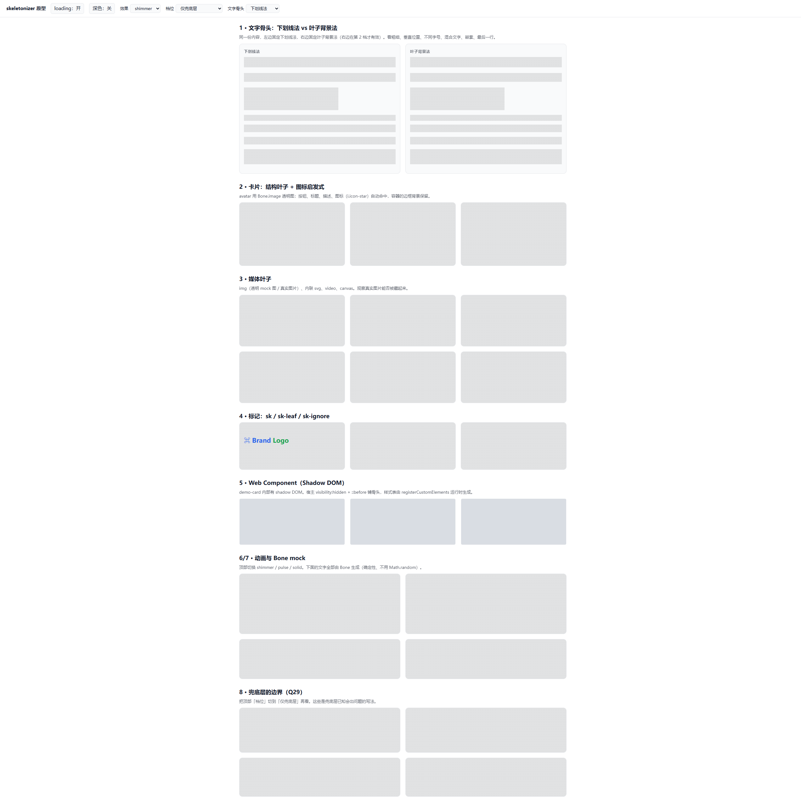
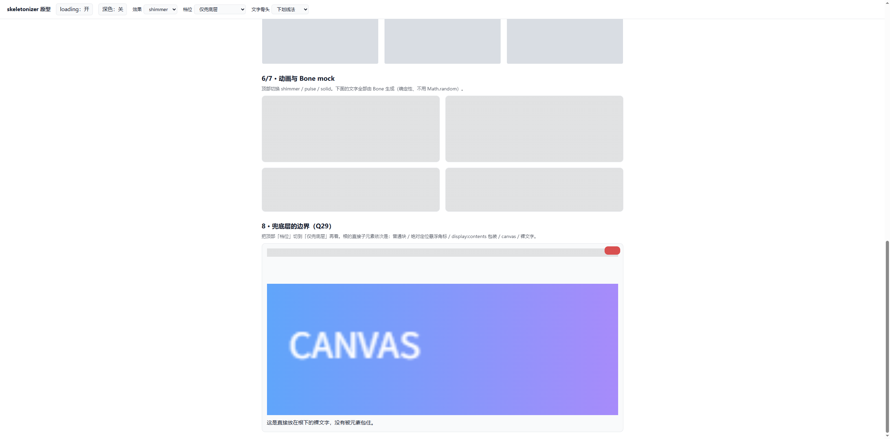
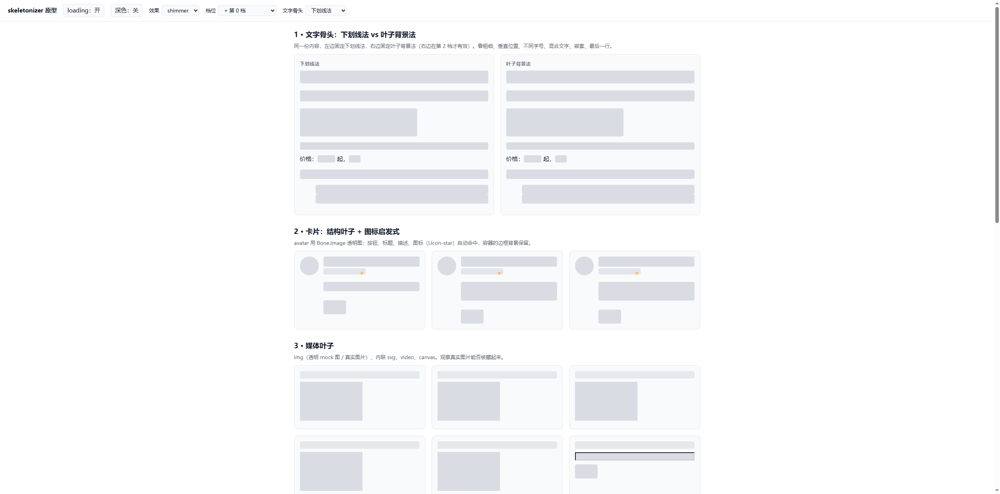
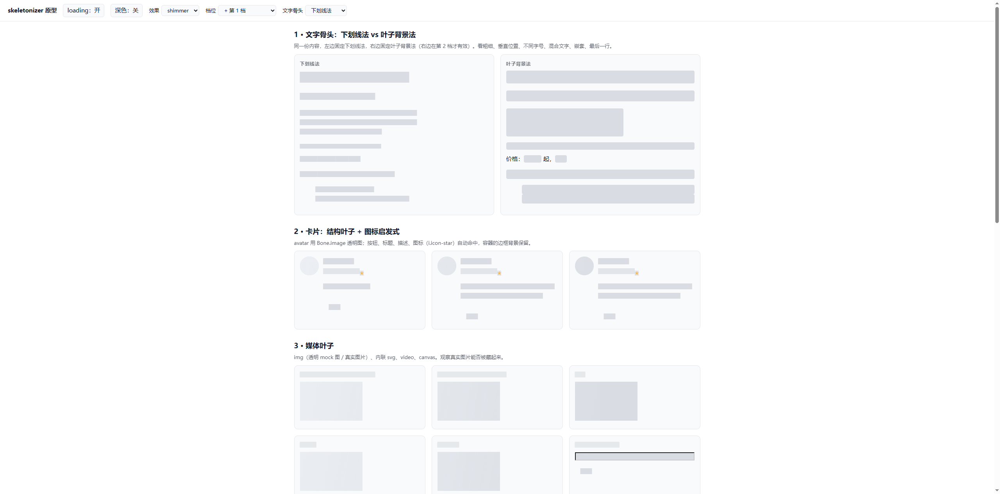
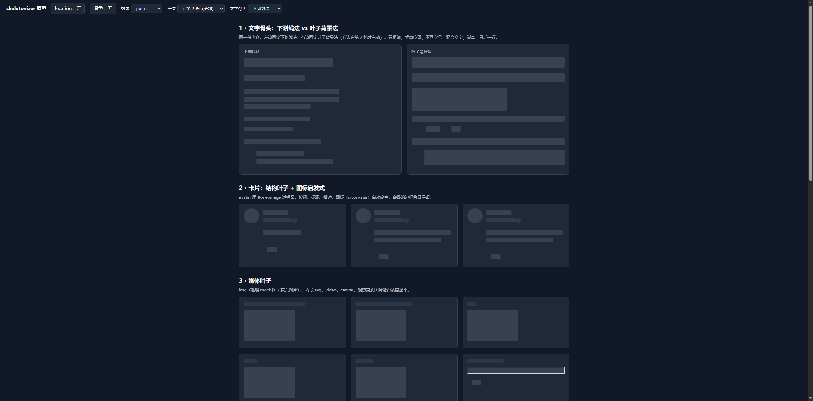
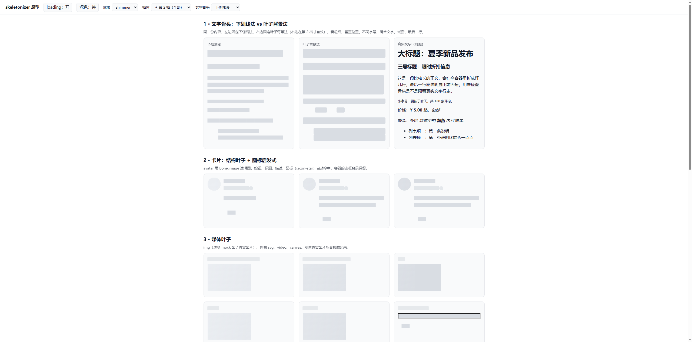

## TL;DR

- 下划线法、`object-position` 藏图、宿主 `::before` 铺骨头、fixed 同步流光：**在桌面 Chrome 上成立**。
- 实测中发现并修了 3 个问题：下划线沿祖先污染 `sk-ignore` 区、下划线文字不 pulse、真实图片/canvas 盖住骨头。
- `lh` 渐变分行**没做**（被下划线法取代）；**iOS / Safari / Firefox / 旧浏览器全部未验证**。

环境：Windows 桌面 Chrome（DevTools 协议驱动），demo 地址 `http://127.0.0.1:5188/demo/index.html`（`python -m http.server 5188`，仓库根目录起）。

## 假设逐条结论

| 假设                                                | 结论                   | 说明 / 最终参数                                                                                                                                               |
| --------------------------------------------------- | ---------------------- | ------------------------------------------------------------------------------------------------------------------------------------------------------------- |
| 下划线法贴合每一行                                  | ✅ 成立                | 与"真实文字"并排对照：h1 / h3 / 正文 / 小字号的条带垂直居中于字身；正文 3 行，**最后一行明显变短且与真实文字行尾位置吻合**                                    |
| 混合文字（`价格：<b>¥5</b> 起`）                    | ✅ 成立                | 整行一条连续带，无需包装节点                                                                                                                                  |
| 嵌套（`p > span > em > strong`）                    | ✅ 不叠色              | 条带为不透明纯色，叠加后仍是同一块                                                                                                                            |
| 不同字号                                            | ✅ 成立                | 厚度 `1em` 随各元素字号走：28px 标题条更粗，小字号条更细                                                                                                      |
| 厚度/偏移最终参数                                   | 采用 `1em` / `-0.85em` | 仅在 `system-ui` 中英文混排下目测；换字体可能需调，已做成变量 `--sk-ul-thickness` / `--sk-ul-offset`                                                          |
| 下划线沿祖先传给 `sk-ignore` 区                     | ⚠️ 实测出现，已修      | Logo 文字下露出一圈灰带。第 2 档用 `:has([sk-ignore])` 让含 ignore 的祖先不画下划线，修复后干净。**只有第 1 档（无 `:has`）仍会有灰带**，未单独验证           |
| 下划线文字的 pulse                                  | ⚠️ 发现 bug，已修      | 第 0 档的文字标签规则把 `animation` 置 `none`，压掉了下划线动画；改为 `var(--sk-anim-ul)` 后，computed `animation-name` 为 `sk-pulse-ul`                      |
| `object-position` 藏真实图                          | ✅ 成立（img、canvas） | `object-fit: none; object-position: 99999px 0` 把内容推出盒子，背景色露出；**`video` 只测了无源的空 video，真实视频未验证**；不支持的元素：`iframe`           |
| `lh` 渐变分行                                       | — 未实现               | 被下划线法取代，不做                                                                                                                                          |
| `fixed` 背景同步流光                                | ✅ 同刻同位            | 同一时刻多个元素 computed `background-position` 相同（`2457.44px 0`）。**局限**：动画从元素启用时开始计时，之后才插入的元素会与已有的错相                     |
| iOS 不支持 `background-attachment: fixed`           | ❓ 未验证              | 设计里已按"需要降级 pulse"处理（`@supports (-webkit-touch-callout: none)`），是否真的需要要上真机                                                             |
| Web Component 宿主 `visibility:hidden` + `::before` | ✅ 成立                | 3 个带 shadow DOM 的 `demo-card` 都命中，内部文字被藏、整块出灰；样式表由 `registerCustomElements` 运行时生成（Chrome 走 `adoptedStyleSheets`），未动任何节点 |
| `<sk-skeleton loading>`                             | ✅ 成立                | 加载时 `class`、`aria-busy="true"`、`inert` 正确；手动清空 class 后被 MutationObserver 补回；关闭后全部清理                                                   |
| 深色模式 / pulse / solid                            | ✅ 深色与 pulse 成立   | `solid` 仅靠变量置空，未单独截图                                                                                                                              |

## 各档位实测表现

| 档位                       | 截图                                          | 观察                                                                                                                                                            |
| -------------------------- | --------------------------------------------- | --------------------------------------------------------------------------------------------------------------------------------------------------------------- |
| 仅兜底层                   |                   | 根的直接子元素各一块灰，`sk-ignore` 的 Logo 保持原样；`Web Component` 宿主自带背景色，灰块偏蓝                                                                  |
| 兜底层的失败场景           |             | 绝对定位角标被涂成一块；`display: contents` 里的两段文字**消失成空白**；`canvas` 真实内容盖在上面；裸文字**照样露出来**（和设计预期"被藏起来"相反，文档已更正） |
| + 第 0 档                  |                   | 标签白名单出块，正文整段一块矩形；"价格：""起，"这类混合文字**露出真实文字**；`<i>` 星标可见                                                                    |
| + 第 1 档                  |                   | 左栏下划线法工作良好；右栏叶子模式因无 `:has` 退回第 0 档效果；星标仍可见                                                                                       |
| + 第 2 档（深色 + pulse）  |            | 图标变圆点骨头，叶子模式下"价格：""嵌套："这类裸文字被藏起来但没有骨头（预期缺口）                                                                              |
| 下划线 vs 叶子 vs 真实文字 |  | 并排对照图，用来校准垂直位置和行宽                                                                                                                              |

## 未验证 / 遗留

- Safari、Firefox、iOS、Android WebView、任何旧浏览器：**全部没测**。
- `inert` 缺失时的降级（`pointer-events` + `focusin` 拦截）：Chrome 有原生 `inert`，该分支没走到。
- `registerCustomElements` 的 `<style>` 降级分支：没走到。
- 真实 `video`、`iframe` 的处理：没测。
- 兜底层对 `visibility: visible` 被业务样式显式写回的情况：只靠 `!important` 压，没做对抗性用例。
- 性能：`:has` 叶子规则在大 DOM 上的开销没测。
- 视觉快照回归（Playwright）还没建。
